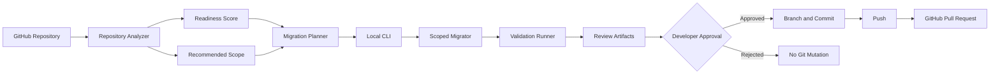

<div align="center">

# CodeShift AI

### Review-first JavaScript-to-TypeScript migration workspace

Analyze legacy JavaScript repositories, generate scoped migration plans, apply conservative transformations, validate changes locally, and open reviewable GitHub pull requests only after explicit approval.

**Migrate code safely — one reviewable pull request at a time.**

[](https://codeshiftweb.vercel.app/)
[](https://github.com/vaibhav7506/codeshift-ai-demo-legacy-js)
[](https://github.com/vaibhav7506/codeshift-ai-demo-legacy-js/pull/1)
[](#license)

</div>

---

## Overview

Most automated migration tools attempt to rewrite too much at once.

CodeShift AI takes a safer approach:

1. Analyze the repository.
2. Measure migration readiness.
3. Recommend a small, reviewable scope.
4. Generate a deterministic migration plan.
5. Apply conservative JavaScript-to-TypeScript changes locally.
6. Run the repository's existing validation scripts.
7. Generate review artifacts.
8. Create a GitHub pull request only after explicit approval.

CodeShift AI is not designed to replace code review.

It is designed to make migrations **smaller, safer, traceable, and easier to inspect**.

---

## Why CodeShift AI?

Large automated rewrites are difficult to trust.

They often:

* modify too many files at once;
* hide risky transformations inside large diffs;
* execute unknown repository code remotely;
* mix planning, editing, validation, and publishing into one irreversible action;
* create pull requests before developers understand what changed.

CodeShift AI separates these responsibilities into explicit stages.

Every migration begins with analysis and planning. Source-code changes happen locally. Validation uses existing project scripts. Git mutations require separate confirmation.

---

## Project Status

| Area                      | Status                                   |
| ------------------------- | ---------------------------------------- |
| MVP                       | Complete                                 |
| Primary migration         | JavaScript → TypeScript                  |
| Web repository analysis   | Available for public GitHub repositories |
| Local migration execution | Available through the CLI                |
| Validation                | Available through existing local scripts |
| GitHub pull request flow  | Available with explicit approval         |
| OpenAI integration        | Implemented                              |
| Groq integration          | Provider contract and adapter stub       |
| Gemini integration        | Provider contract and adapter stub       |
| Anthropic integration     | Provider contract and adapter stub       |

---

## Core Features

### Repository Intelligence

* Public GitHub repository analysis
* Framework detection
* Package-manager detection
* Module-system detection
* JavaScript and TypeScript file counting
* Script discovery
* Migration-readiness scoring
* Recommended migration scopes

### Migration Planning

* Deterministic migration plans
* Explicit migration targets
* Path-scoped execution
* Reviewable plan artifacts
* No source-code mutation during planning

### JavaScript-to-TypeScript Migration

* Scoped `.js` to `.ts` renaming
* Scoped `.jsx` to `.tsx` renaming
* Conservative syntax transformations
* Safe `tsconfig.json` creation or updates
* CommonJS-aware handling
* Warnings for complex or unsafe transformations
* Generated patch and migration-summary artifacts

### Validation

* Runs only existing repository scripts
* Supports `test`, `build`, `typecheck`, and `lint`
* Missing scripts are marked as `SKIPPED`
* Captures structured validation results
* Stores validation logs for review

### GitHub Workflow

* Migration branch creation
* Scoped staging
* Commit creation
* Branch push
* Pull-request creation
* Separate confirmation before every Git mutation
* No automatic commit, push, or PR during migration

### Optional BYOK AI

* Bring Your Own Key architecture
* OpenAI adapter implemented
* Provider contracts for Groq, Gemini, and Anthropic
* Optional migration explanations
* Optional pull-request summaries
* Advisory AI output that cannot expand the selected migration scope
* API keys read only from the current process environment
* No API keys written to logs or migration artifacts

### Product Experience

* Professional repository-analysis dashboard
* Migration-planning interface
* Light, dark, and system themes
* Theme preference stored locally
* Public analysis without mandatory credentials

---

## How It Works



### Execution Boundaries

The web application analyzes public repository metadata and generates plans.

The local CLI performs:

* filesystem analysis;
* source-code transformations;
* validation;
* branch creation;
* commits;
* pushes;
* pull-request creation.

This architecture prevents the web application from executing unknown repository code on a remote server.

---

## Monorepo Structure

```text
codeshift-ai/
├── apps/
│   ├── web/          # Next.js product and dashboard
│   └── cli/          # Local migration, validation, and PR workflow
│
├── packages/
│   ├── shared/       # Shared types and product constants
│   ├── analyzer/     # Repository analysis and readiness scoring
│   ├── migrator/     # Planning, safe transforms, and diff generation
│   └── ai/           # BYOK provider contracts and adapters
│
└── package.json
```

---

## Tech Stack

### Web Application

* Next.js
* React
* TypeScript
* Tailwind CSS

### CLI and Migration Engine

* Node.js
* TypeScript
* Local filesystem analysis
* Git integration
* Local validation runner

### Integrations

* GitHub repositories and pull requests
* OpenAI
* Provider contracts for Groq, Gemini, and Anthropic

---

## Demo

### Demo Repository

[vaibhav7506/codeshift-ai-demo-legacy-js](https://github.com/vaibhav7506/codeshift-ai-demo-legacy-js)

### Demo Pull Request

[View the generated migration pull request](https://github.com/vaibhav7506/codeshift-ai-demo-legacy-js/pull/1)

The demo shows CodeShift AI:

* analyzing a legacy Express JavaScript repository;
* selecting `src/utils` as a small migration scope;
* creating a deterministic migration plan;
* converting the selected scope to TypeScript;
* validating the result locally;
* creating a migration branch;
* pushing the branch;
* opening a reviewable pull request.

---

## Requirements

Before running CodeShift AI locally, install:

* Node.js 20 or newer
* npm 10 or newer
* Git

A GitHub remote is required only for the pull-request workflow.

---

## Run the Web Application Locally

Clone the repository and install dependencies:

```bash
git clone https://github.com/vaibhav7506/codeshift-ai.git
cd codeshift-ai
npm install
```

Start the web application:

```bash
npm run dev --workspace=apps/web
```

Open:

```text
http://localhost:3000
```

Useful routes:

```text
http://localhost:3000
http://localhost:3000/dashboard
http://localhost:3000/settings
```

Public repository analysis works without credentials.

To increase GitHub API rate limits, create:

```text
apps/web/.env.local
```

Add a read-only GitHub token:

```env
GITHUB_TOKEN=your-read-only-token
```

Never expose private tokens through `NEXT_PUBLIC_` variables.

---

## Workspace Commands

```bash
npm run dev
npm run build
npm run typecheck

npm test --workspace=packages/ai
npm test --workspace=packages/analyzer
npm test --workspace=packages/migrator
npm test --workspace=apps/cli
```

---

## Install the CLI Locally

Build and link the CLI:

```bash
npm install
npm run build
npm link --workspace=@codeshift/cli
```

Verify the installation:

```bash
codeshift-ai --help
```

Without linking, run the compiled CLI directly:

```bash
node /path/to/codeshift-ai/apps/cli/dist/index.js --help
```

---

## Complete Migration Workflow

Use a disposable or clean working copy of a legacy JavaScript repository.

Confirm the Git state first:

```bash
cd /path/to/legacy-javascript-repository

git status
git remote -v
```

Run the workflow:

```bash
codeshift-ai analyze

codeshift-ai plan \
  --target js-to-ts \
  --path src/utils

codeshift-ai migrate \
  --target js-to-ts \
  --path src/utils

codeshift-ai validate
```

Review the changes and generated artifacts:

```bash
git diff

cat .codeshift-ai/analysis.json
cat .codeshift-ai/migration-plan.json
cat .codeshift-ai/migration-summary.json
cat .codeshift-ai/patch.diff
cat .codeshift-ai/validation-result.json
cat .codeshift-ai/validation-logs.txt
```

After reviewing everything:

```bash
codeshift-ai pr
```

The PR workflow asks separately before:

1. creating a migration branch;
2. committing migration files;
3. pushing the branch;
4. opening the pull request.

CodeShift AI does not commit, push, or create a pull request during `migrate`.

---

## CLI Reference

### `codeshift-ai analyze`

Analyzes the current repository and writes:

```text
.codeshift-ai/analysis.json
```

It detects:

* framework;
* package manager;
* module system;
* JavaScript and TypeScript file counts;
* available package scripts;
* migration-readiness score;
* recommended migration scopes.

---

### `codeshift-ai plan`

Creates a deterministic migration plan.

```bash
codeshift-ai plan --target js-to-ts --path src/utils
```

Output:

```text
.codeshift-ai/migration-plan.json
```

This command does not modify source files.

---

### `codeshift-ai migrate`

Applies a scoped JavaScript-to-TypeScript migration.

```bash
codeshift-ai migrate --target js-to-ts --path src/utils
```

It may:

* rename `.js` files to `.ts`;
* rename `.jsx` files to `.tsx`;
* create or update `tsconfig.json`;
* apply conservative syntax transformations;
* preserve complex CommonJS patterns and report warnings.

Outputs:

```text
.codeshift-ai/patch.diff
.codeshift-ai/migration-summary.json
```

This command does not commit changes.

---

### `codeshift-ai validate`

Runs supported scripts already defined by the target repository:

```text
test
build
typecheck
lint
```

Missing scripts are recorded as `SKIPPED`.

Outputs:

```text
.codeshift-ai/validation-result.json
.codeshift-ai/validation-logs.txt
```

---

### `codeshift-ai pr`

Creates a reviewable GitHub pull request after explicit approval.

It requires:

* an existing migration summary;
* a valid Git repository;
* a supported GitHub remote;
* migration changes or a valid local migration branch flow.

It stages only files associated with the recorded migration.

---

## Optional BYOK AI

The deterministic migration workflow does not require AI.

AI is optional and is used only for advisory enhancements such as:

* migration explanations;
* warning summaries;
* pull-request descriptions.

### macOS or Linux

```bash
export OPENAI_API_KEY="your-key"

codeshift-ai migrate \
  --target js-to-ts \
  --path src/utils \
  --ai \
  --provider openai
```

### Windows PowerShell

```powershell
$env:OPENAI_API_KEY="your-key"

codeshift-ai migrate `
  --target js-to-ts `
  --path src/utils `
  --ai `
  --provider openai
```

AI output is written to:

```text
.codeshift-ai/ai-enhancement.json
```

The key is read from the current process environment and is never written to artifacts or validation logs.

AI output is advisory. It cannot change the selected scope or bypass deterministic safety rules.

> OpenAI is currently implemented. Groq, Gemini, and Anthropic have provider contracts and adapter stubs but are not yet fully implemented.

---

## Safety Model

CodeShift AI separates planning, execution, validation, and publishing.

### The web application does not:

* clone repositories;
* install dependencies;
* execute repository code;
* run package scripts;
* mutate remote files;
* create pull requests.

### The local CLI:

* executes inside the developer's environment;
* modifies only the selected scope;
* records generated artifacts;
* runs only existing validation scripts;
* requires confirmation before Git mutations;
* keeps AI advisory and scope-limited.

This design reduces the risks of remote code execution, oversized migrations, hidden changes, and unauthorized repository mutations.

---

## Theme System

CodeShift AI supports:

* light mode;
* dark mode;
* system mode.

The initial theme follows the operating-system preference.

Users can change the theme from the navigation bar, dashboard, or settings page. The selected preference is stored in `localStorage`.

---

## Known MVP Limitations

* Only GitHub.com remotes are supported.
* GitHub Enterprise Server is not supported yet.
* `origin` is preferred; otherwise the first configured remote is used.
* The currently checked-out branch is used as the pull-request base.
* Fork-based pull requests are not implemented.
* Draft pull requests are not implemented.
* Updating an existing pull request is not implemented.
* Web-created pull requests are not implemented.
* Groq, Gemini, and Anthropic adapters are not fully implemented.
* Complex CommonJS syntax is preserved instead of being aggressively rewritten.

---

## Roadmap

Planned improvements include:

* GitHub Actions-based execution
* Web-based migration history
* Richer diff viewer
* Pull-request status tracking
* GitHub Enterprise support
* Fork-based pull requests
* Draft pull requests
* Full Groq integration
* Full Gemini integration
* Full Anthropic integration
* React class-component to hooks migration
* Express-to-Hono migration
* CSS-to-Tailwind migration
* Migration recipe marketplace

---

## Project Philosophy

CodeShift AI is not trying to produce the largest possible automatic rewrite.

Its ideal output is:

* a deliberately small migration;
* a transparent plan;
* a readable diff;
* reproducible validation results;
* a pull request that a developer can confidently review, test, and merge.

---

## License

This project is licensed under the MIT License.

---

<div align="center">

Built and maintained by
**[Vaibhav Sharma](https://www.linkedin.com/in/vaibhav-sharma-996aa8249/)**

[Portfolio](https://vaibhav7506portfolio.vercel.app/) · [GitHub](https://github.com/vaibhav7506)

</div>
::: ​​
